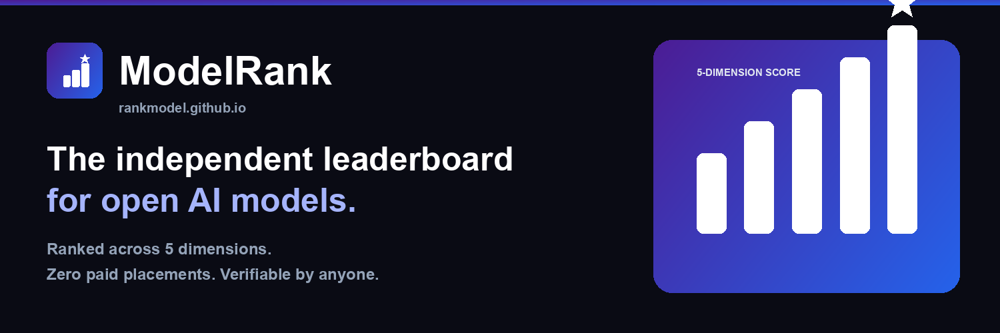

<p align="center"></p>

> The AI benchmarking industry has a conflict-of-interest problem. The labs rating models are the same labs building them. We built ModelRank because you deserve an independent answer.

---

<p align="center">
  <a href="https://github.com/rankmodel/rankmodel.github.io/stargazers"></a>
  
  
  
  <a href="https://github.com/rankmodel/rankmodel.github.io/graphs/contributors"></a>
  
</p>

<p align="center">
  <strong>The independent standard for open-weight AI.</strong><br>
  Transparent 5-dimension scoring · Head-to-head ELO · Free embeddable badges · Zero paid placements.
</p>

---

<p align="center">
  🌐 <a href="https://rankmodel.github.io"><strong>Live Leaderboard</strong></a> &nbsp;·&nbsp;
  🤗 <a href="https://huggingface.co/spaces/pal404error/modelrank"><strong>HuggingFace Space</strong></a> &nbsp;·&nbsp;
  💰 <a href="https://rankmodel.github.io/pricing.html"><strong>Pricing</strong></a> &nbsp;·&nbsp;
  📚 <a href="https://rankmodel.github.io/methodology.html"><strong>Methodology</strong></a> &nbsp;·&nbsp;
  📰 <a href="https://rankmodel.github.io/weekly.html"><strong>Weekly Newsletter</strong></a>
</p>

---

## 📈 Star History

<p align="center">
  <a href="https://star-history.com/#rankmodel/rankmodel.github.io&Date">
    
  </a>
</p>

---

> ⭐ **If ModelRank saves you from deploying the wrong model, star this repo.** It takes 2 seconds and it's how independent tools survive. Stars are the only currency we accept.

---

## The Manifesto

The AI benchmarking status quo is broken in a specific, predictable way: the organizations publishing benchmark results are the same organizations that built the models being tested. That's not science — that's a press release with a chart.

A 7B model beating a 70B model on efficiency is a story nobody with a stake in the game is incentivized to tell. We tell it. ModelRank sits outside the ecosystem — we build no models, sell no weights, take no placements. Our only product is the score, computed from public data, in the open, with weights the community can challenge.

We have no financial incentive to rank any model higher. We don't make models. Independence is the point, not a slogan.

---

## See It Run (10-Second Demo)

```bash
pip install -e .
python main.py score --model mistralai/Mistral-7B-v0.1
python main.py leaderboard --limit 10
python main.py ui   # → http://localhost:7860
python main.py api  # → http://localhost:8000/docs
```


*Demo GIF coming soon — run `vhs demo.tape` to generate locally.*

We ship a `vhs` tape for recording a real terminal session. Generate the animated demo yourself:

```bash
# requires: brew install vhs
cat > demo.tape << 'TAPE'
Output demo.gif
Set FontSize 16
Set Width 1200
Set Height 600
Type "python main.py score --model mistralai/Mistral-7B-v0.1" Enter
Sleep 2s
Type "python main.py leaderboard --limit 10" Enter
Sleep 2s
TAPE
vhs demo.tape
```

No API key required. Add `HF_TOKEN` to your `.env` for higher HuggingFace rate limits.

---

## 🎖️ Get Your Free Badge — Join the Movement

This is how independent tools grow. Paste one line into your model's README and you become part of the leaderboard. Every badge is a live score, a backlink, and a vote for transparency in AI benchmarking.

```markdown


```

Replace `ORG/MODEL` with your HuggingFace path. For example:

```markdown

```

**Live preview →** `https://rankmodel.github.io/badges/meta-llama/Llama-3.1-8B/score.svg`

Generate a custom badge from the CLI:

```bash
python scripts/generate_badge.py --model meta-llama/Llama-3.1-8B --format md
```

Or grab the raw SVG directly, no install required:

```bash
curl -sSL https://rankmodel.github.io/badges/meta-llama/Llama-3.1-8B/score.svg -o modelrank-score.svg
```

Every badge is a statement: *my model's score is public, auditable, and earned.*

Prefer the raw numbers? Download the full ranking as CSV
([`full_rankings_2026-08-20.csv`](https://rankmodel.github.io/full_rankings_2026-08-20.csv))
or JSON (`leaderboard.json`). Every claim on this page is reproducible from that data.

---

## 🧮 How Models Are Scored (Composite, 0–100)

| Dimension | Weight | Measures |
|---|---|---|
| 🧠 **Benchmarks** | **70%** | MMLU-Pro (25%), GPQA (20%), HLE (20%), GSM8K (20%), HumanEval (15%) |
| 🕐 **Recency** | **15%** | 180-day half-life decay — fresh models rise, stale models fade |
| 🔥 **Community** | **10%** | HuggingFace downloads + likes + trending rank |
| ⚡ **Efficiency** | **5%** | Score per billion parameters — small models can win here |
| ✅ **Reproducibility** | **0%** | Source credibility + benchmark diversity (reserved, coming soon) |

Scores are normalized against population bounds — comparable across the full catalog. ELO head-to-head uses the standard formula: `P(A>B) = 1 / (1 + 10^((ELO_B - ELO_A) / 400))`.

Extended signals tracked (not yet weighted): context window, VRAM tier, license type, multilingual support, safety ratings, and momentum.

### Why We Don't Accept Paid Placements

> Every leaderboard that accepts sponsored rankings has a corruption problem, whether they admit it or not. ModelRank's rule is simple: **you cannot buy a higher score.** You can pay for visibility (Featured placement, labeled clearly as such), but the composite score is computed from public benchmark data only. This is the independence guarantee.

We are sustained by optional paid infrastructure (high-volume API access, premium badge styling) — never by moving a score. The composite, the raw data, and the methodology are permanently free.

The scoring weights live in `config/settings.py`. The community votes on changes in [Discussions](https://github.com/rankmodel/rankmodel.github.io/discussions). You can audit or fork the math in minutes.

---

## ⚔️ How We Compare

| Feature | ModelRank | Chatbot Arena | Open LLM LB | Artificial Analysis |
|---|---|---|---|---|
| Embeddable free badges | ✅ | ❌ | ❌ | ❌ |
| Composite 5D score | ✅ | pref-only | bench-only | perf+cost |
| Open source (MIT) | ✅ | ✅ | ✅ | ❌ |
| Efficiency scoring | ✅ | ❌ | ❌ | ✅ |
| Community signals | ✅ | ❌ | ❌ | ❌ |
| ELO head-to-head | ✅ | ✅ | ❌ | ❌ |
| Independent, no conflicts of interest | ✅ | ⚠️ | ⚠️ | ❌ |
| Accepts paid score manipulation | ❌ | ❌ | ❌ | ❓ |

---

## 🥊 Community Head-to-Head (ELO + LLM Judge)

Beyond the composite score, ModelRank tracks direct model comparisons with an ELO rating. Anyone can submit a verdict — human or LLM-judge — and every verdict feeds the community standings live.

```bash
# Record a human verdict
curl -X POST http://localhost:8000/judge/human \
  -H "Content-Type: application/json" \
  -d '{"model_a":"Qwen/Qwen3.5-9B","model_b":"deepseek-ai/DeepSeek-R1","verdict":"A"}'

# See the community ELO standings
curl "http://localhost:8000/elo-leaderboard?limit=10"

# Run the LLM-judge vibe-check (set JUDGE_API_BASE / JUDGE_API_KEY / JUDGE_MODEL)
curl "http://localhost:8000/judge/Qwen/Qwen3.5-9B/deepseek-ai/DeepSeek-R1"
```

Head-to-Head standings are live at [rankmodel.github.io/head-to-head](https://rankmodel.github.io/head-to-head.html). The same data powers the Judge & ELO tab in the Gradio UI.

---

## 🧩 VS Code Extension

Hover any HuggingFace model id in your editor — `meta-llama/Llama-3.1-8B`, `Qwen/Qwen3.5-9B`, anything — and get its ModelRank score, tier, and full 5-dimension breakdown, fetched live from the API.

Built on `ModelRankClient` (source in `vscode-extension/`).

```bash
# Build from source
cd vscode-extension
npm install && npm run compile
```

Install from the VS Code Marketplace *(coming soon)* or build from source above. Every install is another data point proving the demand for independent tooling.

---

## 🐍 Python Client & Agent Tools

```python
from api.client import ModelRankClient

client = ModelRankClient()                        # or ModelRankClient(base_url="http://localhost:8000")
top    = client.leaderboard(limit=10)
score  = client.score("mistralai/Mistral-7B-v0.1")
cmp    = client.compare("Qwen/Qwen3.5-9B", "deepseek-ai/DeepSeek-R1")
```

Drop ModelRank into your own agents via the `integrations/` package:

```python
from integrations.langchain   import get_modelrank_langchain_tools    # LangChain
from integrations.llama_index import get_modelrank_llama_index_tools  # LlamaIndex
```

Available tools: `modelrank_score` · `modelrank_compare` · `modelrank_recommend` · `modelrank_head_to_head`

---

## 🔁 Use ModelRank in CI

Fail a build when a model drops below a target score or tier. Ship with confidence, not hope.

```yaml
- uses: rankmodel/rankmodel.github.io/.github/actions/modelrank-check@main
  with:
    model_id: 'your-org/your-model'
    min_score: '70'
    min_tier: 'B'
```

If the model's score drops below your threshold, the CI step fails. Your pipeline becomes a quality gate — no more surprise regressions.

---

## ❓ FAQ — Pre-emptive Troll Disarmament

**Q: Your dataset is too small / you only have 954 models.**

> A: We seed from HuggingFace's top 1,000 most-downloaded models and expand weekly. 954 is the *verified* set — models with complete benchmark data across all five dimensions. Coverage is a community effort. [Submit your model →](https://github.com/rankmodel/rankmodel.github.io/issues/new?template=model-submission.md)

---

**Q: Your scoring is biased toward benchmark performance, which anyone can game.**

> A: True — that is why benchmark data only represents **70%** of the score, and all benchmark sources are public and auditable. Community signals, recency, and efficiency make up the remaining 30%. If you think a specific benchmark is being gamed, [open an issue](https://github.com/rankmodel/rankmodel.github.io/issues) and name it. We'll investigate and document the finding publicly.

---

**Q: This is just a popularity contest. Downloads ≠ quality.**

> A: The Community dimension is **10%** of the total score. The other 90% is benchmark performance, recency, and efficiency. A model can rank #1 with zero downloads if its benchmarks are exceptional. We show all five dimensions transparently so you can judge for yourself — and disagree in public if you want.

---

**Q: Why should I trust you? You're just another random GitHub project.**

> A: You shouldn't take our word for it. That is the entire point — the scoring formula, the weights, the benchmark sources, and the raw data are all open source. **Fork it. Verify it. Challenge it.** We welcome every pull request that improves accuracy. The scoreboard's legitimacy is earned by scrutiny, not claimed by authority.

---

## 🤝 Contributing

Read [CONTRIBUTING.md](CONTRIBUTING.md) for the full guide. The short version: **every contribution type is valued equally** — code, documentation, model submissions, and spreading the word.

Not a coder? We have contributions for everyone — documentation, model submissions, and spreading the word. Open source is a team sport and we keep score of every player.

---

## 🏅 Projects That Trust ModelRank

Add our badge to your model card and tell us — we'll feature you here. Open an issue with
your model + repo and we'll add it to the wall. No entries yet; be the first.

## 📄 License

[MIT](LICENSE). ModelRank is independent and has no affiliation with HuggingFace, Meta, Google, or any model creator.

---

<p align="center">
  Built with stubbornness and public data. &nbsp;·&nbsp;
  <a href="https://rankmodel.github.io">rankmodel.github.io</a>
</p>
