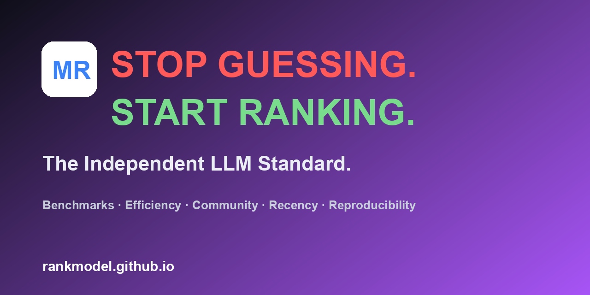

# 🏆 ModelRank

<p align="center">
  
  
  <a href="https://github.com/rankmodel/rankmodel.github.io/stargazers"></a>
  <a href="https://github.com/rankmodel/rankmodel.github.io/graphs/contributors"></a>
  
</p>

<p align="center">
  
</p>

<p align="center">
  <b>The independent standard for open-weight AI.</b><br>
  A leaderboard that sits on top of HuggingFace, Ollama, and every hub. Transparent
  5-dimension scoring, head-to-head ELO, and free embeddable badges.
</p>

<p align="center">
  🌐 <a href="https://rankmodel.github.io">Live Leaderboard</a> ·
  🤗 <a href="https://huggingface.co/spaces/pal404error/modelrank">HuggingFace Space</a> ·
  💰 <a href="https://rankmodel.github.io/pricing.html">Pricing</a> ·
  📚 <a href="https://rankmodel.github.io/methodology.html">Methodology</a> ·
  📰 <a href="https://rankmodel.github.io/weekly.html">Weekly</a>
</p>

> ⭐ **The AI industry is lying to you about model performance.** Vendors publish the
> benchmark they won and bury the ones they lost. ModelRank is the independent scorecard:
> every model, the same ruler, no money in the room. If it helps you cut through the hype,
> star the repo. It is free, and stars are how an independent project survives.

---

## The manifesto

We are not a model factory and we do not host weights. We have no reason to rank our own
models higher, because we do not make any. Independence is the point, not a slogan.

A 7B model can beat a 70B model on efficiency. ModelRank is built to surface that. We score
what is measurable, weight it in the open, and let the community move the weights when they
disagree. The score is a starting argument, not a verdict from on high.

## Why we don't accept paid placements

ModelRank makes exactly zero dollars from ranking models, and we intend to keep it that way.

- **No sponsored spots.** A spot on the leaderboard is earned by publicly observable signals
  (benchmarks, efficiency, community, recency). There is no "contact us to rank higher" path.
- **No affiliate links.** We do not earn a commission when you download or deploy a model.
- **No owned models.** We cannot bias the board toward a product we sell, because we sell none.
- **Weights are public and votable.** The scoring weights live in `config/settings.py` and the
  community votes on changes in Discussions. You can audit or fork the math in minutes.

If a leaderboard is funded by the models it ranks, ask who the score is really for.

## Features

- **Transparent 5-dimension scoring.** Benchmarks, efficiency, community, recency, and
  reproducibility, all weighted and reproducible from public signals.
- **Head-to-head ELO.** Compare any two models and see live win probabilities from community
  and LLM-judge verdicts.
- **Free embeddable badges.** Drop a score or tier badge into your README. Every badge links
  back to the leaderboard.
- **Agent-ready.** A zero-dependency Python client, plus LangChain and LlamaIndex tools.
- **VS Code extension.** Hover any `org/model` id and see its score and breakdown instantly.
- **ModelRank Weekly.** A data-driven newsletter on the model landscape, published every week.

## See it run (10-second demo)

We ship a `vhs` tape that records a real terminal session of the Python client. Generate the
GIF yourself:

```bash
# requires: brew install vhs
cat > demo.tape <<'TAPE'
Output demo.gif
Set FontSize 16
Type "python main.py score --model mistralai/Mistral-7B-v0.1" Enter
Sleep 2s
TAPE
vhs demo.tape
```

 <!-- placeholder: run the vhs tape above to generate -->

## Try it in 10 seconds

```bash
pip install -e .
python main.py score --model mistralai/Mistral-7B-v0.1
```

Or run the live leaderboard UI (Gradio):

```bash
python main.py ui   # → http://localhost:7860
```

Or hit the REST API:

```bash
python main.py api  # → http://localhost:8000/docs
```

No API key is needed to use ModelRank. Add `HF_TOKEN` for higher HuggingFace rate limits.

## Get your free badge

Paste this into your model's README and you are on the leaderboard:

```markdown


```

Replace `ORG/MODEL` with your HuggingFace path (for example `meta-llama/Llama-3.1-8B`).
Every badge is a backlink to the leaderboard, which is how the community grows. Generate a
custom badge with `python scripts/generate_badge.py --model ORG/MODEL --format md`.

## How models are scored (composite, 0 to 100)

| Dimension | Weight | Measures |
|-----------|--------|----------|
| 🧠 **Benchmarks** | 70% | MMLU-Pro (0.25), GPQA (0.20), HLE (0.20), GSM8K (0.20), HumanEval (0.15) |
| 🕐 **Recency** | 15% | 180-day half-life decay |
| 🔥 **Community** | 10% | Downloads + likes + trending rank |
| ⚡ **Efficiency** | 5% | Score per billion params (rewards small models) |
| ✅ **Reproducibility** | 0% | Source credibility + benchmark diversity (reserved) |

Plus ELO head-to-head (`P(A>B) = 1 / (1 + 10^((ELO_B-ELO_A)/400))`) and extended
signals (context window, VRAM tier, license, multilingual, safety, momentum, and so on).
Benchmarks are normalized against population bounds so the score is comparable across
the whole catalog.

## How we compare

| Feature | ModelRank | Chatbot Arena | Open LLM LB | Artificial Analysis |
|---------|-----------|---------------|-------------|---------------------|
| Embeddable free badges | ✅ | ❌ | ❌ | ❌ |
| Composite 5D score | ✅ | pref-only | bench-only | perf+cost |
| Open source (MIT) | ✅ | ✅ | ✅ | ❌ |
| Efficiency scoring | ✅ | ❌ | ❌ | ✅ |
| Community signals | ✅ | ❌ | ❌ | ❌ |
| Independent, no conflicts of interest | ✅ | ⚠️ | ⚠️ | ❌ |

## Community head-to-head (ELO + LLM judge)

Beyond the composite score, ModelRank runs direct comparisons between models
and tracks them with an ELO rating. Anyone can judge a pair, either a human verdict or
an impartial LLM vibe-check, and every verdict feeds the community standings.

```bash
# Record a human verdict
curl -X POST http://localhost:8000/judge/human \
  -H "Content-Type: application/json" \
  -d '{"model_a":"Qwen/Qwen3.5-9B","model_b":"deepseek-ai/DeepSeek-R1","verdict":"A"}'

# See the community standings
curl "http://localhost:8000/elo-leaderboard?limit=10"

# Run the LLM-judge vibe-check (set JUDGE_API_BASE / JUDGE_API_KEY / JUDGE_MODEL)
curl "http://localhost:8000/judge/Qwen/Qwen3.5-9B/deepseek-ai/DeepSeek-R1"
```

The same data powers the public [Head-to-Head](https://rankmodel.github.io/head-to-head.html)
page (ELO standings + verdict feed) and the Judge and ELO tab in the Gradio UI.

## VS Code extension

Hover any HuggingFace model id in your editor, such as `meta-llama/Llama-3.1-8B` or
`Qwen/Qwen3.5-9B`, and get its ModelRank score, tier, and 5-dimension breakdown, fetched
live from the API. Built on `ModelRankClient` (`vscode-extension/`, run `npm install && npm run compile`).

## Python client and agent tools

```python
from api.client import ModelRankClient

client = ModelRankClient()                       # or ModelRankClient(base_url="http://localhost:8000")
top = client.leaderboard(limit=10)
score = client.score("mistralai/Mistral-7B-v0.1")
cmp = client.compare("Qwen/Qwen3.5-9B", "deepseek-ai/DeepSeek-R1")
```

Drop ModelRank into your own agents via the `integrations/` package:

```python
from integrations.langchain import get_modelrank_langchain_tools   # LangChain
from integrations.llama_index import get_modelrank_llama_index_tools  # LlamaIndex
```

Tools: `modelrank_score`, `modelrank_compare`, `modelrank_recommend`, `modelrank_head_to_head`.

## Use ModelRank in CI

Fail a build when a model drops below a score or tier:

```yaml
- uses: rankmodel/rankmodel.github.io/.github/actions/modelrank-check@main
  with:
    model_id: 'your-org/your-model'
    min_score: '70'
    min_tier: 'B'
```

## FAQ

**"Your data is small."** We rank what is publicly observable on HuggingFace, and the catalog
grows every time the daily job runs. The method is the product: the same scoring code runs on
150+ models today and 15,000 tomorrow. Every input is a public signal you can verify.

**"You are biased."** Toward what? We make no models, take no placements, and publish the
weights. If you think a dimension is mis-weighted, open a Discussion and vote. The board moves
when the community moves it. That is the opposite of bias hidden behind a closed rubric.

**"This is just a popularity contest."** Benchmarks are 70% of the score and community is 10%.
A model with huge downloads and weak benchmarks sinks. Efficiency and recency are objective.
Popularity can lift a model a little; it cannot manufacture a score it did not earn.

## License

[MIT](LICENSE). ModelRank is independent and has no affiliation with HuggingFace, Meta, Google, or any model creator.
